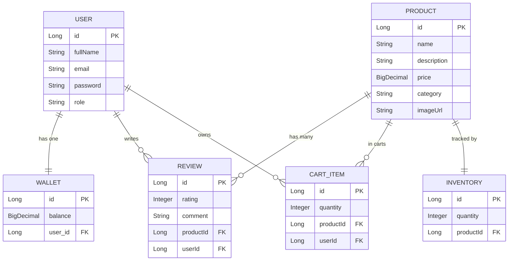

# E-Commerce Platform

A scalable and secure e-commerce platform built with a microservices architecture using Spring Boot and Spring Cloud.

## Architecture Overview

The system is composed of several independent microservices communicating via REST and OpenFeign:

- **API Gateway**: Centralized entry point for all client requests. Handles routing and security (JWT validation, Role-Based Access Control).
- **Eureka Server**: Service Registry for dynamic service discovery and load balancing.
- **Shop Service**: Manages the core e-commerce domains, including products, shopping carts, wishlists, customer reviews, and order processing.
- **Wallet Service**: Manages user financial accounts, processing deposits, withdrawals, and transaction history.

## Technologies Used

- Java 17
- Spring Boot
- Spring Cloud (Eureka, Gateway, Config, OpenFeign)
- Spring Data JPA
- JWT Authentication
- Maven
- Cloudinary API

## Project Structure

```text
EjadaProj
├── api-gateway        # Central API routing and JWT security (Port 8000)
├── config-repo        # Centralized Git-backed configuration properties
├── config-server      # Spring Cloud Config Server (Port 8888)
├── eureka-server      # Netflix Eureka Service Registry (Port 8761)
├── inventory-service  # Manages product stock levels (Port 8084)
├── shop-service       # Core e-commerce domains, carts, and image uploads (Port 8081)
└── wallet-service     # User authentication, JWT issuance, and wallets (Port 8082)
```

## Database Diagram

The system uses a microservices-per-database pattern. Below is the logical relationship map:



## Prerequisites

To run this project locally, ensure you have the following installed:
- Java Development Kit (JDK) 17 or higher
- Maven 3.8+
- A relational database (PostgreSQL or MySQL)

## Running the Application

To start the system, the microservices must be booted in a specific order to ensure proper registration:

1. **Start the Eureka Server**: Navigate to the `eureka-server` directory and run the application. Wait for it to initialize completely on port 8761.
2. **Start the API Gateway**: Navigate to the `api-gateway` directory and start the application. It will register with Eureka and listen on port 8080.
3. **Start the Core Services**: Start both the `wallet-service` and `shop-service`. They will automatically register with Eureka and become accessible through the API Gateway.

## API Access

All requests should be routed through the API Gateway (port 8080). Direct access to individual microservice ports should be avoided.

When accessing protected endpoints (such as Cart, Orders, or Wallet operations), a valid JWT token must be provided in the Authorization header.

## Database Reliability

The system implements distributed transactional logic. During checkout, if a user has insufficient funds in their wallet, the HTTP OpenFeign call will fail and trigger a database rollback within the Shop Service, ensuring data consistency and preventing orphaned orders. Pagination is implemented across all large data sets (Products, Reviews) to ensure system stability at scale.
